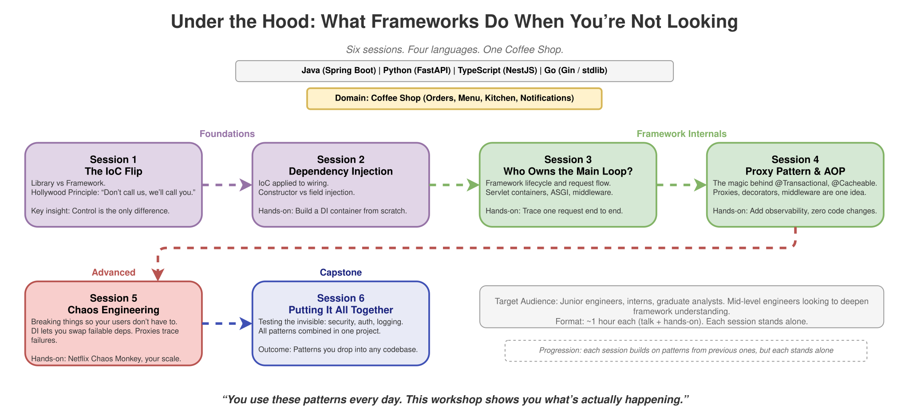

# Under the Hood: What Frameworks Do When You're Not Looking

> **Six standalone sessions that peel back the layers of modern frameworks, from IoC to Chaos Engineering**

## The Problem

You use Spring Boot, FastAPI, NestJS, or Gin every day. You write `@Autowired`, `@app.get()`, `@Controller()`, and it all just works.

But what's actually happening underneath? How does the framework know when to call your code? How does `@Transactional` wrap your method without you touching it? What happens when
a dependency fails at 2 AM?

These are patterns that show up in every language and every stack, but rarely get explained properly.

I kept running into the same gap: engineers who could *use* frameworks fluently but couldn't explain *how* they work. That's what this series is about.

<picture>
  <source media="(prefers-color-scheme: dark)" srcset="docs/diagrams/dark/under-the-hood-overview.svg">
  <source media="(prefers-color-scheme: light)" srcset="docs/diagrams/light/under-the-hood-overview.svg">
  
</picture>

## What This Is

Six sessions, each covering one core pattern. They build on each other, but each session stands on its own with its own runnable examples. Start from the beginning or jump straight
to the topic you're curious about.

**Languages:** Java (Spring Boot), Python (FastAPI), TypeScript (NestJS), Go (Gin / stdlib)

**Domain:** All sessions use the same [Coffee Shop domain](domain/README.md). Simple enough to focus on the patterns, complex enough to be realistic.

---

## Sessions

### [Session 1: The IoC Flip; Why a Framework Is Just a Library Turned Inside Out](session-01-ioc-flip/)

> `#ioc` `#fundamentals` `#library-vs-framework` `#java` `#python` `#typescript` `#go`

What's the difference between a library and a framework? If you said "size" or "features", keep reading.

The real answer is one word: control. A library is code you call. A framework is code that calls you. That flip is called Inversion of Control, and in Hollywood they have the same
rule: "Don't call us, we'll call you."

### [Session 2: Dependency Injection; Let the Framework Do the Wiring](session-02-dependency-injection/)

> `#di` `#ioc` `#spring` `#fastapi` `#nestjs` `#go`

You write `@Autowired`, `Depends()`, or NestJS providers every day, but what's actually going on underneath?

DI is IoC applied to how your objects get their dependencies: you say what you need, the framework figures out the rest. We'll settle the constructor vs field injection debate,
compare how DI works across four languages, and build a tiny DI container from scratch.

### [Session 3: Who Owns the Main Loop? IoC Beyond Dependency Injection](session-03-who-owns-the-main-loop/)

> `#ioc` `#lifecycle` `#middleware` `#request-flow` `#spring` `#fastapi` `#gin` `#nestjs`

IoC doesn't stop at wiring beans together. Your framework also controls when things start, what runs before your handler fires, and how a request travels through the system.

This session maps out the real machinery: servlet containers, ASGI lifecycles, middleware pipelines. We'll trace one request end to end so you can see who's really driving.

### [Session 4: Proxy Pattern and AOP; How Framework "Magic" Actually Works](session-04-proxy-and-aop/)

> `#proxy` `#aop` `#decorators` `#middleware` `#spring` `#fastapi` `#nestjs` `#go`

Every annotation you love (`@Transactional`, `@Cacheable`, `@UseGuards`) is doing the same thing: wrapping your code in a proxy.

This session starts with the Proxy pattern, then shows how decorators in Python/TS and middleware in Go are the same idea in different clothes. Hands-on: add full observability to
a service without touching a single line of its code.

### [Session 5: Chaos Engineering; Breaking Things So Your Users Don't Have To](session-05-chaos-engineering/)

> `#chaos` `#testing` `#failure-injection` `#resilience` `#spring` `#fastapi` `#nestjs` `#go`

Happy-path tests feel great until production disagrees.

This session is about breaking stuff intentionally: making services crash, stall, or return garbage, and watching how the system holds up.

DI (from Session 2) lets you swap a real dependency for a failable one. Proxies (from Session 4) make every failure traceable. Same principles Netflix built into Chaos Monkey.

### [Session 6: Putting It All Together; Testing the Invisible](session-06-capstone/)

> `#capstone` `#e2e` `#observability` `#all-patterns` `#spring` `#fastapi` `#nestjs` `#go`

Some features are invisible by design: security interceptors, auth middleware, logging pipelines. You can't see them, but they'd better work.

This final session connects every pattern from the series into one project. DI to inject tracers, proxies to observe without modifying, chaos to stress without fear. You'll build
it hands-on.

---

## Who This Is For

Junior engineers, interns, and graduate analysts. Mid-level engineers looking to deepen their understanding of framework internals are also welcome. The content focuses on
universally applicable patterns, not specific tools or internal systems.

## How to Use This

Each session is a self-contained learning module with a README explaining the concept, code examples in all four languages, and hands-on exercises. Pick a session, read the
material, run the code, try the exercises. No setup beyond cloning the repo and having the language runtime installed.

## Terminology

| Term      | Full Name                   | One-liner                                                 |
|-----------|-----------------------------|-----------------------------------------------------------|
| **IoC**   | Inversion of Control        | The framework calls your code, not the other way around   |
| **DI**    | Dependency Injection        | You declare what you need, the framework provides it      |
| **AOP**   | Aspect-Oriented Programming | Apply behavior across many classes without modifying them |
| **Proxy** | Proxy Pattern               | An object that wraps another to control access to it      |
