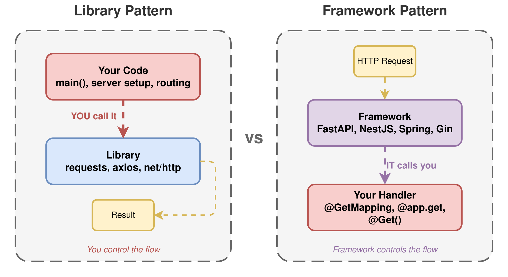
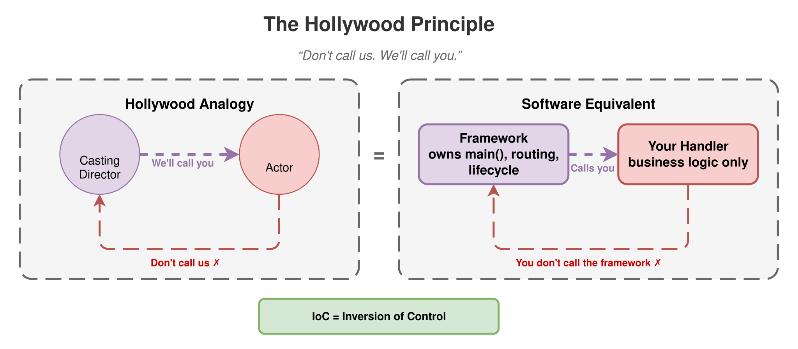
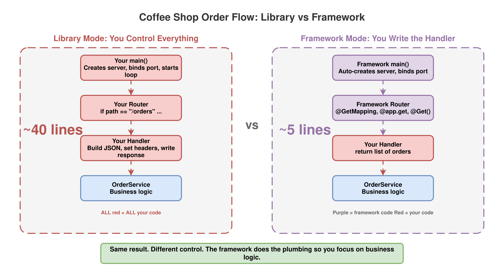

# Session 1: The IoC Flip

> **Why a Framework Is Just a Library Turned Inside Out**

`#ioc` `#fundamentals` `#library-vs-framework` `#java` `#python` `#typescript` `#go`

## The Problem

Ask ten engineers: "What's the difference between a library and a framework?"

You'll get ten different answers. Most will say something about size, features, or "a framework gives you more structure."

These aren't wrong exactly, but they miss the real point. I kept hearing these answers and thinking: there has to be a simpler way to explain this.

The real answer is one word: **control**.

## The One-Word Answer

A **library** is code **you** call. You're in charge. You decide when to call it, how to call it, and what to do with the result. Think `requests.get()` in Python, `axios.get()` in
TypeScript, or `http.Get()` in Go. You wrote the `main()`, you run the show.

A **framework** is code that **calls you**. The framework owns the main loop. It decides when your code runs. You just fill in the blanks. Think FastAPI route handlers, NestJS
controllers, Spring `@RestController`, or Gin handler functions.

That flip, from "you call it" to "it calls you", is called **Inversion of Control (IoC)**.

<picture>
  <source media="(prefers-color-scheme: dark)" srcset="diagrams/dark/library-vs-framework.svg">
  <source media="(prefers-color-scheme: light)" srcset="diagrams/light/library-vs-framework.svg">
  
</picture>

## The Hollywood Principle

There's a classic way to remember this. In Hollywood, after an audition, they tell you:

> "Don't call us. We'll call you."

That's exactly how a framework works. You register your handler, your controller, your route, and then you wait. The framework will call you when it's time. You don't get to decide
when. You don't even get to decide *how* your code gets invoked. The framework controls that.

With a library, the opposite is true. You're the director. You call the shots.

This pattern has been around for decades. It shows up in every language and every stack. Once you see it, you can't unsee it.

<picture>
  <source media="(prefers-color-scheme: dark)" srcset="diagrams/dark/hollywood-principle.svg">
  <source media="(prefers-color-scheme: light)" srcset="diagrams/light/hollywood-principle.svg">
  
</picture>

## The Most Famous Example You Already Know

If you've done any frontend work, you've seen this exact split: **React vs Angular**.

React calls itself a library, and it means it. You call `createRoot()`, you decide when to render, you pick your own router, your own state manager, your own folder structure.
React gives you components and gets out of the way. You're the director.

Angular is a framework. It owns the module system, the router, the dependency injection, the change detection, the build pipeline. You declare components and services, Angular
decides when to instantiate them, when to call lifecycle hooks, when to re-render. You fill in the blanks.

Same pattern. Same flip. React: you call it. Angular: it calls you.

Astro is another beautiful example. You write `.astro` files with components and pages, and Astro controls the entire build, routing, and rendering pipeline. You never call
`astro.render()`. Astro finds your pages, decides what to pre-render, what to hydrate, and when. You just write the components.

This isn't about which is "better." It's about understanding the tradeoff: control vs convention. Libraries give you freedom. Frameworks give you structure. IoC is the line between
them.

## Seeing It in Code

Here's the same idea across four languages: handle an HTTP request that returns a list of coffee orders. Two approaches each: library-style (you own the loop) and framework-style
(the framework owns the loop).

### Python

**Library style** (you call `http.server`):

```python
from http.server import HTTPServer, BaseHTTPRequestHandler
import json


class OrderHandler(BaseHTTPRequestHandler):
    def do_GET(self):
        if self.path == "/orders":
            orders = [{"id": 1, "drink": "Latte"}, {"id": 2, "drink": "Espresso"}]
            self.send_response(200)
            self.send_header("Content-Type", "application/json")
            self.end_headers()
            self.wfile.write(json.dumps(orders).encode())


# YOU start the server. YOU own the loop.
server = HTTPServer(("", 8000), OrderHandler)
server.serve_forever()
```

**Framework style** (FastAPI calls you):

```python
from fastapi import FastAPI

app = FastAPI()


@app.get("/orders")
def list_orders():
    # FastAPI calls this function when a GET /orders request arrives.
    # You never call it yourself.
    return [{"id": 1, "drink": "Latte"}, {"id": 2, "drink": "Espresso"}]
```

Notice: in the FastAPI version, there's no `main()`, no `serve_forever()`, no explicit server setup. You declare *what* should happen, the framework decides *when*.

### Go

**Library style** (you wire `http.HandleFunc` and call `ListenAndServe`):

```go
package main

import (
    "encoding/json"
    "net/http"
)

func main() {
    http.HandleFunc("/orders", func(w http.ResponseWriter, r *http.Request) {
        orders := []map[string]any{
            {"id": 1, "drink": "Latte"},
            {"id": 2, "drink": "Espresso"},
        }
        w.Header().Set("Content-Type", "application/json")
        json.NewEncoder(w).Encode(orders)
    })
    // YOU call ListenAndServe. YOU own the startup.
    http.ListenAndServe(":8000", nil)
}
```

**Framework style** (Gin owns the routing and lifecycle):

```go
package main

import "github.com/gin-gonic/gin"

func main() {
    r := gin.Default()
    r.GET("/orders", func(c *gin.Context) {
        // Gin calls this. You just registered it.
        c.JSON(200, []gin.H{
            {"id": 1, "drink": "Latte"},
            {"id": 2, "drink": "Espresso"},
        })
    })
    r.Run(":8000")
}
```

Go is interesting here. The stdlib `net/http` is technically a library, but `ListenAndServe` already inverts control for request handling. Gin takes it further: it owns middleware,
routing, error recovery, and the full request lifecycle.

### TypeScript

**Library style** (Node.js `http` module, you do everything):

```typescript
import http from "http";

const server = http.createServer((req, res) => {
    if (req.url === "/orders" && req.method === "GET") {
        const orders = [{id: 1, drink: "Latte"}, {id: 2, drink: "Espresso"}];
        res.writeHead(200, {"Content-Type": "application/json"});
        res.end(JSON.stringify(orders));
    }
});

// YOU start the server.
server.listen(8000);
```

**Framework style** (NestJS controls everything):

```typescript
import {Controller, Get} from "@nestjs/common";

@Controller("orders")
export class OrderController {
    @Get()
    listOrders() {
        // NestJS calls this when GET /orders arrives.
        return [{id: 1, drink: "Latte"}, {id: 2, drink: "Espresso"}];
    }
}
```

With NestJS, you don't even see the HTTP server. The framework creates it, configures it, starts it, and routes requests to your controller. You just annotate a class.

### Java

**Library style** (plain `HttpServer` from the JDK):

```java
import com.sun.net.httpserver.HttpServer;

import java.net.InetSocketAddress;

public class Main {
    public static void main(String[] args) throws Exception {
        var server = HttpServer.create(new InetSocketAddress(8000), 0);
        server.createContext("/orders", exchange -> {
            var json = "[{\"id\":1,\"drink\":\"Latte\"},{\"id\":2,\"drink\":\"Espresso\"}]";
            exchange.getResponseHeaders().set("Content-Type", "application/json");
            exchange.sendResponseHeaders(200, json.length());
            exchange.getResponseBody().write(json.getBytes());
            exchange.close();
        });
        // YOU start the server.
        server.start();
    }
}
```

**Framework style** (Spring Boot calls your controller):

```java
import org.springframework.web.bind.annotation.GetMapping;
import org.springframework.web.bind.annotation.RestController;

import java.util.List;
import java.util.Map;

@RestController
public class OrderController {
    @GetMapping("/orders")
    public List<Map<String, Object>> listOrders() {
        // Spring calls this. You never invoke it directly.
        return List.of(
            Map.of("id", 1, "drink", "Latte"),
            Map.of("id", 2, "drink", "Espresso")
        );
    }
}
```

Where's the `main()`? Where's the server setup? Spring Boot handles all of that. You annotate, Spring calls. That's IoC.

## The Pattern Across Languages

| Aspect                     | Library                           | Framework                                     |
|----------------------------|-----------------------------------|-----------------------------------------------|
| **Who owns `main()`?**     | You do                            | The framework does                            |
| **Who starts the server?** | You call `listen()` / `serve()`   | The framework starts it                       |
| **Who routes requests?**   | You write `if/switch` on the path | The framework matches routes to your handlers |
| **Who calls your code?**   | You call it                       | The framework calls it                        |
| **Control direction**      | You -> Library                    | Framework -> You                              |

<picture>
  <source media="(prefers-color-scheme: dark)" srcset="diagrams/dark/coffeeshop-library-vs-framework.svg">
  <source media="(prefers-color-scheme: light)" srcset="diagrams/light/coffeeshop-library-vs-framework.svg">
  
</picture>

## The Coffee Shop Analogy

Think of it this way:

**Library mode**: You're the barista AND the manager. You take orders, you make coffee, you call the customer's name. You control every step.

**Framework mode**: You're just the barista. The manager (framework) takes orders, decides which barista handles which drink, and tells you when to start making a latte. You're
good at making lattes, but you don't decide when or for whom.

IoC is the moment you stop being the manager and start being the barista. You give up control of the flow, and in return you get to focus on what matters: making great coffee (or
writing great business logic).

## Try It Yourself

Each language subfolder has two runnable projects: a `library/` version and a `framework/` version of the same Coffee Shop order endpoint.

1. **Run both versions** side by side. They do the same thing. Same endpoint, same response.
2. **Add a new endpoint** (`GET /menu`) to both versions. Notice how much more code you write in the library version vs the framework version.
3. **Add logging** that prints every incoming request. In the library version, you add it manually. In the framework version, you'll discover middleware (a preview
   of [Session 3](../session-03-who-owns-the-main-loop/)).
4. **Break something.** Return an error from your handler. Watch how the library version crashes vs how the framework version handles it gracefully.

The goal: feel the difference in control. Notice where you write *less* code with a framework, and think about what the framework is doing for you behind the scenes.

## Key Takeaways

- **IoC is not a feature. It's a design principle.** The framework calls your code, not the other way around.
- **The Hollywood Principle** ("Don't call us, we'll call you") is the simplest way to remember it.
- **Every framework you use applies IoC.** Spring, FastAPI, NestJS, Gin: they all own the main loop and call your handlers.
- **IoC is the foundation.** Sessions 2-6 build on this. DI is IoC applied to wiring. Middleware is IoC applied to request flow. AOP is IoC applied to cross-cutting concerns.

## Language Examples

| Language   | Framework    | Folder                     |
|------------|--------------|----------------------------|
| Java       | Spring Boot  | [java/](java/)             |
| Python     | FastAPI      | [python/](python/)         |
| TypeScript | NestJS       | [typescript/](typescript/) |
| Go         | Gin / stdlib | [go/](go/)                 |

---

*Next up: [Session 2: Dependency Injection](../session-02-dependency-injection/) - IoC applied to how your objects get wired together.*
