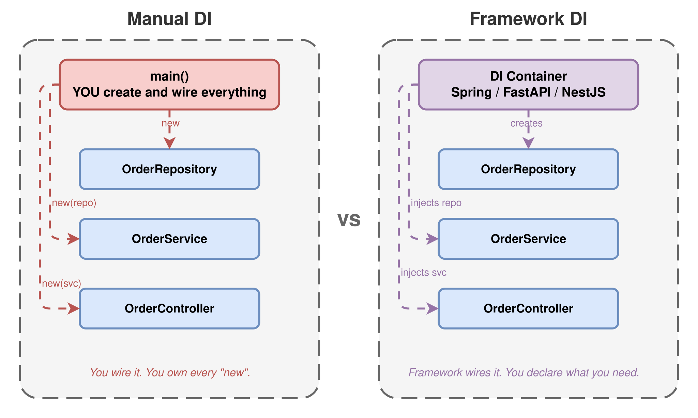
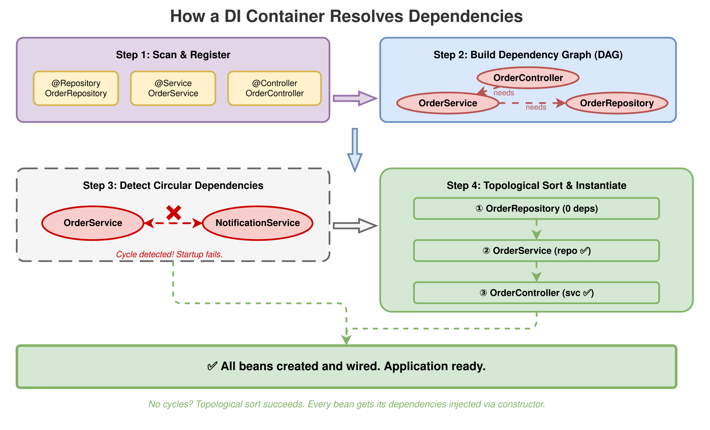
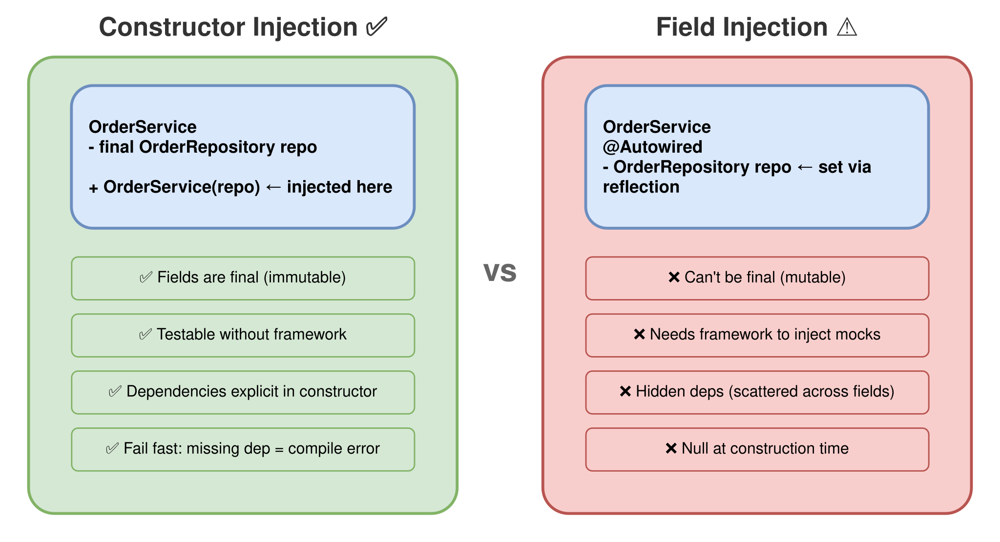

# Session 2: Dependency Injection

> **What Actually Happens When You Write `@Autowired`**

`#di` `#ioc` `#spring` `#fastapi` `#nestjs` `#go`

## The Problem

In [Session 1](../session-01-ioc-flip/) we saw that a framework calls your code. But there's a follow-up question: how does your code get the things it needs?

Say your `OrderController` needs an `OrderService`, and that service needs an `OrderRepository`. In a library-style project, you'd wire it by hand:

```java
var repo = new OrderRepository();
var service = new OrderService(repo);
var controller = new OrderController(service);
```

Three lines. Not bad. But real projects don't have three classes. They have thirty, or three hundred, and the dependency graph gets messy fast. You end up with a `main()` that's
fifty lines of constructor calls, and every time you add a new dependency, you have to update it manually.

There has to be a better way. And there is: you tell the framework *what* you need, and the framework figures out *how* to provide it. That's Dependency Injection (DI).

But here's the thing: most tutorials stop here. They show you the annotation, show you it works, and move on. We're going deeper. We're going to understand how DI containers
actually work, build one from scratch, and see what happens when the registry grows to hundreds or thousands of instances.

## What Is Dependency Injection?

DI is a specific form of IoC (from [Session 1](../session-01-ioc-flip/)). Instead of your code creating its own dependencies, it declares what it needs, and something else provides
them.

Three roles:

- **The consumer** - your class that needs something (e.g. `OrderService`)
- **The dependency** - the thing it needs (e.g. `OrderRepository`)
- **The injector** - the thing that provides it (e.g. Spring, FastAPI, NestJS, or you)

The key insight: your class never calls `new` on its dependencies. It receives them from outside. That's it. That's the whole pattern.

## Manual DI vs Framework DI

Here's the thing that confused me at first: DI is not a framework feature. It's a design pattern. You can do it yourself, no framework required.

**Manual DI** (you're the injector):

```java
// YOU create the dependencies. YOU wire them together.
var repo = new InMemoryOrderRepository();
var service = new OrderService(repo);
var controller = new OrderController(service);
```

This is already DI. The `OrderService` doesn't create its own repository. It receives it through the constructor. You're injecting the dependency manually.

**Framework DI** (the framework is the injector):

```java
// Spring scans your classes, sees what each one needs,
// creates them in the right order, and wires everything.
@Service
public class OrderService {
    private final OrderRepository repository;

    // Spring sees this constructor, finds an OrderRepository bean,
    // and injects it automatically.
    public OrderService(OrderRepository repository) {
        this.repository = repository;
    }
}
```

Same pattern. Same result. But the framework does the wiring for you. You declare dependencies, the framework resolves them.

<picture>
  <source media="(prefers-color-scheme: dark)" srcset="diagrams/dark/manual-vs-framework-di.svg">
  <source media="(prefers-color-scheme: light)" srcset="diagrams/light/manual-vs-framework-di.svg">
  
</picture>

## Under the Hood: How a DI Container Actually Works

This is the part most tutorials skip. You annotate a class with `@Service`, and magically it appears wherever you need it. But there's no magic. The container does four concrete
things at startup, in this exact order.

### Step 1: Discovery - Finding Your Classes

Before the container can create anything, it needs to know what exists. This happens through **component scanning**.

In Spring, when your application starts, the framework scans every class on the classpath starting from your `@SpringBootApplication` package. It looks for annotations:
`@Component`, `@Service`, `@Repository`, `@Controller`, and anything meta-annotated with `@Component`. Each match becomes a **bean definition** - not an instance yet, just a
recipe: "this class exists, here's how to create it."

NestJS does something similar but explicit: you register providers in module `@Module({ providers: [...] })` declarations. FastAPI uses `Depends()` to define factory functions. Go
doesn't scan anything - you wire it manually in `main()`.

The result of this step is a **registry**: a map of type -> bean definition.

```
Registry:
  OrderRepository    -> BeanDef{class=InMemoryOrderRepository, scope=singleton}
  OrderService       -> BeanDef{class=OrderService, scope=singleton, deps=[OrderRepository]}
  OrderController    -> BeanDef{class=OrderController, scope=singleton, deps=[OrderService]}
```

### Step 2: Dependency Graph - Building the Wiring Plan

Now the container has a list of bean definitions. But it can't just create them in any order. `OrderService` needs `OrderRepository` to exist first. `OrderController` needs
`OrderService`. The container needs to figure out the right creation order.

This is a classic computer science problem: **topological sorting** of a directed acyclic graph (DAG).

The container builds a dependency graph by inspecting each bean's constructor (or factory function, or `Depends()` chain). It reads the parameter types and looks them up in the
registry. The result is a directed graph:

```
OrderController -> OrderService -> OrderRepository
```

The container then topologically sorts this graph to get a valid creation order:

```
1. OrderRepository   (no dependencies)
2. OrderService      (depends on OrderRepository - already created)
3. OrderController   (depends on OrderService - already created)
```

This is simple with three beans. With 1,000+ beans in a real Spring application, the graph can be deep and wide. But the algorithm is the same: find nodes with no unresolved
dependencies, create them, mark them as resolved, repeat.

<picture>
  <source media="(prefers-color-scheme: dark)" srcset="diagrams/dark/dependency-graph.svg">
  <source media="(prefers-color-scheme: light)" srcset="diagrams/light/dependency-graph.svg">
  
</picture>

### Step 3: Circular Dependency Detection

What happens if `A` depends on `B` and `B` depends on `A`? The topological sort fails. There's no valid creation order.

```
OrderService -> NotificationService -> OrderService  // cycle!
```

Every serious DI container detects this at startup and fails with a clear error:

```
BeanCurrentlyInCreationException: Error creating bean 'orderService':
Requested bean is currently in creation: Is there an unresolvable circular reference?
```

Spring used to "solve" circular dependencies by creating an incomplete bean and injecting it before it was fully initialized (via field injection). This was always fragile, and
Spring 6 disabled it by default. The real fix is to redesign: extract the shared logic into a third service, or use an event/message pattern instead of direct references.

NestJS has the same problem and offers `forwardRef()` as an escape hatch, but it's also a design smell.

The takeaway: if the container tells you there's a cycle, it's telling you there's a design problem in your code.

### Step 4: Instantiation and Injection

Now the container walks the sorted dependency list and creates instances. For each bean:

1. Look up the bean definition in the registry
2. Resolve all constructor parameters by finding their instances in the already-created beans
3. Call the constructor with the resolved parameters
4. Store the instance (for singletons) or discard the definition (for prototypes)
5. Run any post-construction hooks (`@PostConstruct`, `OnModuleInit`, etc.)

This is where the "magic" of `@Autowired` lives. The container uses reflection (Java), type metadata (TypeScript with `emitDecoratorMetadata`), or function introspection (Python)
to read constructor parameter types at runtime, then matches them against the registry.

## The Hard Part: Multiple Instances of the Same Type

Three beans, one of each type. Easy. But what happens when you have two implementations of `OrderRepository`?

```java

@Repository
public class InMemoryOrderRepository implements OrderRepository {
    // ...
}

@Repository
public class PostgresOrderRepository implements OrderRepository {
    // ...
}
```

Now `OrderService` asks for an `OrderRepository`, and the container finds two. Which one does it inject?

This is where frameworks diverge:

**Spring** fails with `NoUniqueBeanDefinitionException`. You fix it with:

- `@Primary` - marks one as the default
- `@Qualifier("postgres")` - names the bean, and the consumer requests a specific name
- `@Profile("prod")` / `@Profile("test")` - activates beans conditionally per environment

**NestJS** uses string or symbol tokens:

```typescript
@Module({
    providers: [
        {provide: 'ORDER_REPO', useClass: PostgresOrderRepository},
    ],
})
```

Then inject with `@Inject('ORDER_REPO')`.

**FastAPI** solves this naturally because `Depends()` takes a specific factory function. There's no ambiguity: the function you pass IS the implementation.

**Go** doesn't have this problem at the framework level. You pass the specific implementation in `main()`. Ambiguity is a compile-time decision, not a runtime one.

This is one of the most common DI headaches in real projects, especially when you add testing profiles, feature flags, or multi-tenant configurations. Understanding how your
framework resolves it saves hours of debugging.

## Scopes: Not Everything Is a Singleton

By default, most DI containers create one instance per type and reuse it everywhere. That's a **singleton** scope. But it's not the only option.

| Scope         | Spring name | NestJS name | Behavior                              |
|---------------|-------------|-------------|---------------------------------------|
| **Singleton** | `singleton` | `DEFAULT`   | One instance, shared everywhere       |
| **Prototype** | `prototype` | `TRANSIENT` | New instance every time it's injected |
| **Request**   | `request`   | `REQUEST`   | One instance per HTTP request         |

Why does this matter? Imagine an `OrderService` that holds state (a counter, a cache, a transaction). If it's a singleton, that state is shared across all requests and all threads.
In Java, that means thread-safety issues. In Python (with async), that means shared mutable state across coroutines.

Request scope creates a fresh instance per HTTP request. It's slower (more allocations) but safer for stateful services. Most services should be stateless singletons. When they
can't be, scope is the escape hatch.

## Constructor vs Field Injection

This debate comes up in every DI conversation. Let me settle it.

**Constructor injection** (recommended):

```java

@Service
public class OrderService {
    private final OrderRepository repository;

    public OrderService(OrderRepository repository) {
        this.repository = repository;
    }
}
```

**Field injection** (convenient but problematic):

```java

@Service
public class OrderService {
    @Autowired
    private OrderRepository repository;
}
```

Field injection looks cleaner, but it has real problems:

- **You can't make fields `final`.** The object is created first, then fields are set via reflection. The dependency could be null during construction.
- **You can't test without a framework.** There's no constructor to call, so you need Spring (or reflection) to inject mocks.
- **Hidden dependencies.** Looking at the constructor tells you nothing about what the class needs. The dependencies are scattered across fields.
- **Circular dependency hiding.** Constructor injection makes cycles fail at startup. Field injection can hide them until a weird NPE at runtime.

Constructor injection makes dependencies explicit, immutable, and testable. Every major framework recommends it. Spring even lets you skip `@Autowired` on a single constructor
since Spring 4.3.

<picture>
  <source media="(prefers-color-scheme: dark)" srcset="diagrams/dark/constructor-vs-field-injection.svg">
  <source media="(prefers-color-scheme: light)" srcset="diagrams/light/constructor-vs-field-injection.svg">
  
</picture>

## Building a DI Container from Scratch

We promised we'd build one, so let's do it. Here's a minimal DI container in Python. It does the same four steps we just described:
register, resolve the dependency graph, detect cycles, and instantiate. Python's `inspect` module and type hints make the internals very readable.

```python
import inspect


class Container:
    def __init__(self):
        self._registry: dict[type, type] = {}  # interface -> implementation
        self._instances: dict[type, object] = {}  # singleton cache
        self._in_progress: set[type] = set()  # cycle detection

    def register(self, base_type: type, impl_type: type):
        """Step 1: Register a type mapping."""
        self._registry[base_type] = impl_type

    def resolve[T](self, requested_type: type[T]) -> T:
        """Steps 2-4: Resolve a type by walking the dependency graph."""
        # Singleton: already created? Return it.
        if requested_type in self._instances:
            return self._instances[requested_type]

        # Step 3: Circular dependency detection
        if requested_type in self._in_progress:
            raise RuntimeError(f"Circular dependency detected: {requested_type.__name__}")
        self._in_progress.add(requested_type)

        # Look up the implementation class
        impl = self._registry.get(requested_type, requested_type)

        # Step 2: Read constructor params = the dependency graph edges
        params = inspect.signature(impl.__init__).parameters
        deps = {
            name: self.resolve(param.annotation)  # recursion = graph walk
            for name, param in params.items()
            if name != "self" and param.annotation != inspect.Parameter.empty
        }

        # Step 4: Instantiate with resolved dependencies
        instance = impl(**deps)
        self._instances[requested_type] = instance
        self._in_progress.discard(requested_type)
        return instance
```

Usage:

```python
class OrderRepository:
    def find_all(self) -> list[dict]:
        return [{"id": 1, "drink": "Latte"}]


class OrderService:
    def __init__(self, repo: OrderRepository):
        self.repo = repo

    def list_orders(self) -> list[dict]:
        return self.repo.find_all()


container = Container()
container.register(OrderRepository, OrderRepository)
container.register(OrderService, OrderService)

service = container.resolve(OrderService)
print(service.list_orders())  # [{"id": 1, "drink": "Latte"}]
```

That's ~30 lines. No decorators, no classpath scanning. Just `inspect.signature()` to read constructor parameter types and a recursive `resolve()` that walks the dependency graph.
The `_in_progress` set catches cycles. The `_instances` dict gives you singletons.

This is the same core algorithm that Spring, NestJS, and every other DI container uses. The frameworks just add annotation scanning, scope management, lifecycle hooks, and better
error messages on top.

The language examples include a working version of this container in each language. Python uses `inspect`, Java uses reflection, TypeScript uses decorator metadata, and Go uses
plain functions and interfaces.

## How DI Works Across Languages

The mechanism is different, but the pattern is identical.

### Java (Spring Boot)

Spring uses component scanning and constructor injection:

```java

@Service
public class OrderService {
    private final OrderRepository repository;

    public OrderService(OrderRepository repository) {
        this.repository = repository;
    }

    public List<Order> listOrders() {
        return repository.findAll();
    }
}
```

Spring sees `@Service`, creates a bean, finds `OrderRepository` in the bean registry, and passes it to the constructor.

**Deep dive in [java/](java/):** Spring `BeanFactory` vs `ApplicationContext`, `@Primary` vs `@Qualifier`, bean lifecycle hooks, `@Profile` for environment-specific wiring, and how
Spring Boot auto-configuration works under the hood.

### Python (FastAPI)

FastAPI uses the `Depends()` function:

```python
def get_order_repository() -> OrderRepository:
    return InMemoryOrderRepository()


@app.get("/orders")
def list_orders(repo: OrderRepository = Depends(get_order_repository)):
    return repo.find_all()
```

`Depends()` tells FastAPI: "call this function and pass the result as a parameter." The route handler never creates its own repository.

**Deep dive in [python/](python/):** How `Depends()` chains work, nested dependencies, `yield` dependencies for resource cleanup (DB sessions, file handles), and the difference
between FastAPI DI and full-blown DI libraries like `dependency-injector`.

### TypeScript (NestJS)

NestJS uses decorators and a module system:

```typescript

@Injectable()
export class OrderService {
    constructor(private readonly repository: OrderRepository) {
    }

    listOrders(): Order[] {
        return this.repository.findAll();
    }
}
```

`@Injectable()` marks the class as DI-managed. NestJS reads the constructor parameter types and injects matching providers from the module.

**Deep dive in [typescript/](typescript/):** How NestJS uses `reflect-metadata` and `emitDecoratorMetadata` to read types at runtime, custom providers (`useClass`, `useValue`,
`useFactory`), injection tokens for interfaces, and module scoping.

### Go

Go doesn't have a DI framework built in. You do it manually, and that's actually the convention:

```go
type OrderService struct {
    repo OrderRepository
}

func NewOrderService(repo OrderRepository) *OrderService {
    return &OrderService{repo: repo}
}
```

No magic. No annotations. You wire it in `main()`. Some teams use [Wire](https://github.com/google/wire) or [Uber's fx](https://github.com/uber-go/fx) for larger projects, but
manual DI is idiomatic Go.

**Deep dive in [go/](go/):** Why the Go community prefers manual DI, how interfaces make it work without a framework, Google Wire's code generation approach vs Uber fx's runtime
reflection approach, and the `functional options` pattern for complex constructors.

## The Pattern Across Languages

| Aspect                   | Java (Spring)               | Python (FastAPI)    | TypeScript (NestJS)         | Go                |
|--------------------------|-----------------------------|---------------------|-----------------------------|-------------------|
| **Declare a dependency** | Constructor param           | `Depends()` param   | Constructor param           | Constructor param |
| **Mark as injectable**   | `@Service`/`@Component`     | Factory function    | `@Injectable()`             | Not needed        |
| **Who wires it**         | Spring container            | FastAPI runtime     | NestJS module system        | You, in `main()`  |
| **Injection style**      | Constructor                 | Function parameter  | Constructor                 | Constructor       |
| **Multiple impls**       | `@Qualifier`/`@Primary`     | Different factory   | Token-based                 | Explicit in code  |
| **Scopes**               | singleton/prototype/request | per-request default | singleton/transient/request | Manual            |

## Why This Matters

DI isn't just about convenience. It changes how you structure and test code:

- **Testability.** You can inject a mock repository instead of a real database. No framework needed for unit tests.
- **Flexibility.** Swap `InMemoryOrderRepository` for `PostgresOrderRepository` without touching `OrderService`.
- **Separation of concerns.** Each class does one thing and declares what it needs. The wiring happens elsewhere.
- **Chaos Engineering preview.** In [Session 5](../session-05-chaos-engineering/), we'll swap real dependencies for failable ones using DI. The service doesn't know the difference.

## Try It Yourself

Each language subfolder has a runnable Coffee Shop project with DI wiring: `OrderController` -> `OrderService` -> `OrderRepository`.

1. **Run the project** and hit `GET /orders`. Trace the call chain: controller -> service -> repository. Notice that no class creates its own dependencies.
2. **Add a `MenuService`** with its own `MenuRepository`. Wire it using DI and expose `GET /menu`. Feel how much faster it is when the container does the wiring for you.
3. **Swap the repository.** Create a second `OrderRepository` implementation that returns different data. Change the wiring without modifying `OrderService`. In Spring, use
   `@Primary`. In NestJS, use a different provider. In Go, just pass the new one in `main()`.
4. **Write a test.** Create a unit test for `OrderService` that injects a mock/stub repository. No framework, no database, no HTTP. Just constructor injection and assertions.
5. **Build a DI container.** Each language example includes a `container/` folder with a minimal DI container implementation. Read it, run it, extend it: add scope support
   (singleton vs transient) or error messages for missing registrations.

> **Want to check your work?** Each language README links to a solution branch where all exercises are already implemented.

## Key Takeaways

- **DI is a pattern, not a framework feature.** You can do it manually in any language. Go proves it.
- **Under the hood, it's a dependency graph.** The container builds a DAG, topologically sorts it, detects cycles, and instantiates in order.
- **Constructor injection is the way.** It makes dependencies explicit, immutable, and testable. Field injection hides problems.
- **Multiple implementations of the same type** is where DI gets real. Understand `@Qualifier`/`@Primary`/tokens in your framework.
- **Scopes matter.** Singleton is the default, but request-scoped and transient instances exist for good reasons.
- **You can build a DI container in 40 lines.** The algorithm is simple. The frameworks just add classpath scanning, annotations, and lifecycle management on top.

## Language Examples

Each language folder includes the DI-wired Coffee Shop project AND a minimal DI container implementation you can study and extend. The language-specific READMEs go deeper into
framework-specific DI features, gotchas, and advanced patterns.

| Language   | Framework    | Folder                     |
|------------|--------------|----------------------------|
| Java       | Spring Boot  | [java/](java/)             |
| Python     | FastAPI      | [python/](python/)         |
| TypeScript | NestJS       | [typescript/](typescript/) |
| Go         | Gin / stdlib | [go/](go/)                 |

---

*Previous: [Session 1: The IoC Flip](../session-01-ioc-flip/) - What makes a framework different from a library.*

*Next up: [Session 3: Who Owns the Main Loop?](../session-03-who-owns-the-main-loop/) - IoC beyond dependency injection: lifecycle, middleware, and request flow.*
