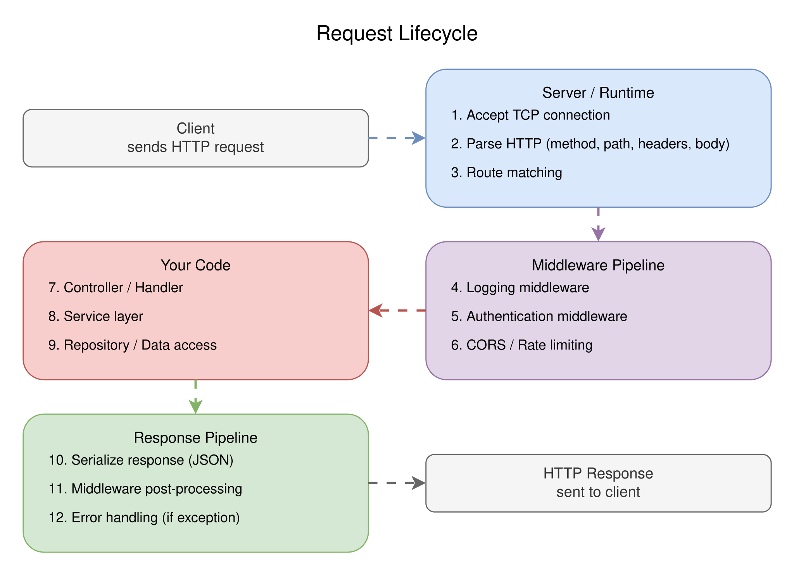
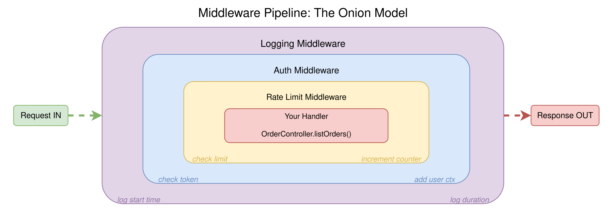
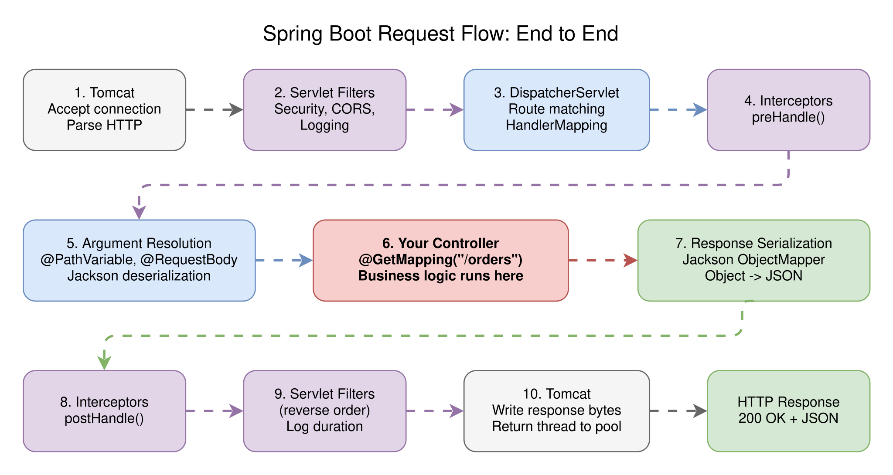

# Session 3: Who Owns the Main Loop?

> **IoC Beyond Dependency Injection: Lifecycle, Middleware, and the Request Pipeline**

`#ioc` `#lifecycle` `#middleware` `#request-flow` `#spring` `#fastapi` `#gin` `#nestjs`

## The Problem

In [Session 1](../session-01-ioc-flip/) we saw the IoC flip: the framework calls your code. In [Session 2](../session-02-dependency-injection/) we saw DI: the framework wires your
dependencies. But there's a bigger question we haven't answered yet:

**What happens between the moment a request hits the server and the moment your handler runs?**

You write a controller method. Spring, FastAPI, NestJS, or Gin calls it. But who parsed the HTTP request? Who deserialized the body? Who checked authentication? Who logged the
request? Who handled the error when your code threw an exception? Who serialized the response back to JSON?

None of that is your code. The framework did all of it. And it did it in a specific order, through a specific pipeline, with specific hooks where you can plug in. Understanding
that pipeline is the difference between "it works" and "I know why it works."

## The Request Lifecycle: What Really Happens

When a client sends `GET /orders`, here's what actually happens before your handler sees it. Every framework follows the same general shape, even though the implementation details
differ.

```
Client sends HTTP request
        │
        ▼
┌─── Server / Runtime ─────────────────────────┐
│  1. Accept TCP connection                     │
│  2. Parse HTTP (method, path, headers, body)  │
│  3. Route matching                            │
└───────────────┬───────────────────────────────┘
                │
                ▼
┌─── Middleware Pipeline ───────────────────────┐
│  4. Logging middleware                        │
│  5. Authentication middleware                 │
│  6. CORS middleware                           │
│  7. Body parsing / validation                 │
└───────────────┬───────────────────────────────┘
                │
                ▼
┌─── Your Code ─────────────────────────────────┐
│  8. Controller / Handler runs                 │
│  9. Service layer called                      │
│  10. Repository returns data                  │
└───────────────┬───────────────────────────────┘
                │
                ▼
┌─── Response Pipeline ─────────────────────────┐
│  11. Serialize response (JSON)                │
│  12. Middleware (post-processing)             │
│  13. Error handling (if exception)            │
│  14. Send HTTP response                       │
└───────────────────────────────────────────────┘
```

That's 14 steps. Your code is steps 8-10. The framework owns the other 11. This is IoC at a much deeper level than DI.

<picture>
  <source media="(prefers-color-scheme: dark)" srcset="diagrams/dark/request-lifecycle.svg">
  <source media="(prefers-color-scheme: light)" srcset="diagrams/light/request-lifecycle.svg">
  
</picture>

## The Server Layer: Who Accepts the Connection?

Before any of your code runs, the HTTP server has to accept a TCP connection, read bytes off the socket, and parse them into an HTTP request. Each framework delegates this to a
different runtime.

**Java (Spring Boot)** runs on an embedded **Tomcat** (or Jetty/Netty). Tomcat is a servlet container: it manages a thread pool, accepts connections, and creates
`HttpServletRequest`/`HttpServletResponse` objects. Spring Boot auto-configures Tomcat for you. You never see `ServerSocket.accept()`. The servlet container owns the I/O loop.

**Python (FastAPI)** runs on **Uvicorn**, an ASGI (Asynchronous Server Gateway Interface) server. Uvicorn is a `uvloop`-based event loop that accepts connections and speaks the
ASGI protocol. FastAPI is an ASGI application: Uvicorn calls it with a `scope`, `receive`, and `send` coroutine for each request. You never write `socket.recv()`. Uvicorn owns the
event loop.

**TypeScript (NestJS)** runs on **Express** (default) or **Fastify** under the hood. NestJS wraps these as "platform adapters." Express handles TCP connections, parses HTTP, and
passes `req`/`res` objects up. NestJS sits on top and adds its own decorator-driven routing, DI, and middleware system. You never see `http.createServer()`. Express owns the I/O.

**Go (Gin)** wraps the stdlib `net/http` server. Go's HTTP server uses goroutines: one goroutine per connection, managed by the Go runtime scheduler. Gin adds routing, middleware,
and context handling on top. The `net/http` server owns the accept loop.

| Framework   | HTTP Server       | I/O Model         | Your code sees       |
|-------------|-------------------|-------------------|----------------------|
| Spring Boot | Tomcat (embedded) | Thread pool       | `@RestController`    |
| FastAPI     | Uvicorn (ASGI)    | Async event loop  | `@app.get()` handler |
| NestJS      | Express / Fastify | Event loop (Node) | `@Controller` method |
| Gin         | `net/http`        | Goroutines        | `gin.HandlerFunc`    |

## Middleware: The Pipeline Before (and After) Your Code

Middleware is the framework's mechanism for running code before and after your handler, without modifying the handler itself. Think of it as a chain of functions that wrap your
request.

Every framework implements middleware differently, but the mental model is the same: an **onion**. Each middleware layer wraps the next one. The request goes in through all layers,
hits your handler at the center, and the response comes back out through the same layers in reverse.

```
Request  ──▶  [Logging]  ──▶  [Auth]  ──▶  [Your Handler]  ──▶  Response
              ◀──────────────  ◀──────────  ◀───────────────
              (post-process)   (post-process)
```

This is why middleware can:

- **Short-circuit** the pipeline (auth fails? return 401, never call the handler)
- **Modify the request** (add a user object after auth)
- **Modify the response** (add headers, compress body)
- **Measure timing** (record time before and after the handler)

<picture>
  <source media="(prefers-color-scheme: dark)" srcset="diagrams/dark/middleware-pipeline.svg">
  <source media="(prefers-color-scheme: light)" srcset="diagrams/light/middleware-pipeline.svg">
  
</picture>

### Middleware in Each Framework

**Spring Boot** has a layered middleware system. From outermost to innermost:

1. **Servlet Filters** - raw HTTP level, `javax.servlet.Filter`. CORS, security headers, request logging.
2. **HandlerInterceptors** - Spring MVC level, `HandlerInterceptor`. Pre-handle (before controller), post-handle (after controller), after-completion (after response).
3. **AOP Aspects** - method level (covered in [Session 4](../session-04-proxy-and-aop/)).

```java

@Component
public class RequestLoggingFilter implements Filter {
    @Override
    public void doFilter(ServletRequest req, ServletResponse res, FilterChain chain) {
        System.out.println("Before handler");
        chain.doFilter(req, res);  // call the next filter or the handler
        System.out.println("After handler");
    }
}
```

The `chain.doFilter()` call is the key: it passes control to the next layer. If you don't call it, the request never reaches your controller.

**FastAPI** uses ASGI middleware and its own `Depends()` system:

```python
@app.middleware("http")
async def log_requests(request: Request, call_next):
    print("Before handler")
    response = await call_next(request)  # call the next middleware or handler
    print("After handler")
    return response
```

`call_next` is the equivalent of `chain.doFilter()`. FastAPI also supports Starlette middleware classes and standard ASGI middleware.

**NestJS** has three middleware-like mechanisms:

1. **Middleware** - Express-style `(req, res, next)` functions. Applied per route.
2. **Guards** - return `true`/`false` to allow or deny access. Used for auth.
3. **Interceptors** - wrap the handler execution. Can transform the response, add logging, or handle errors.
4. **Pipes** - transform or validate input data before it reaches the handler.

```typescript

@Injectable()
export class LoggingInterceptor implements NestInterceptor {
    intercept(context: ExecutionContext, next: CallHandler): Observable<any> {
        console.log('Before handler');
        return next.handle().pipe(
            tap(() => console.log('After handler')),
        );
    }
}
```

**Gin** uses a simple handler chain:

```go
func LoggingMiddleware() gin.HandlerFunc {
    return func(c *gin.Context) {
        fmt.Println("Before handler")
        c.Next()  // call the next middleware or handler
        fmt.Println("After handler")
    }
}

r.Use(LoggingMiddleware())
```

`c.Next()` passes control to the next handler in the chain. `c.Abort()` short-circuits: stops the chain and returns immediately.

## Lifecycle Hooks: When Things Start and Stop

Middleware handles the per-request lifecycle. But frameworks also control the **application lifecycle**: what happens at startup and shutdown.

### Startup

When your application starts, the framework does a lot before it's ready to accept requests:

1. **Load configuration** (environment variables, config files, profiles)
2. **Create the DI container** (Session 2's four steps: scan, graph, detect cycles, instantiate)
3. **Run startup hooks** (your initialization code)
4. **Start the HTTP server** (bind to port, start accepting connections)
5. **Register signal handlers** (SIGTERM, SIGINT for graceful shutdown)

| Event             | Spring Boot             | FastAPI                     | NestJS                  | Go / Gin          |
|-------------------|-------------------------|-----------------------------|-------------------------|-------------------|
| Container created | `ApplicationContext`    | app instantiation           | `NestFactory.create()`  | `main()` wiring   |
| Post-init hook    | `@PostConstruct`        | `@app.on_event("startup")`  | `OnModuleInit`          | Your code in main |
| Server listening  | `ApplicationReadyEvent` | Uvicorn logs "started"      | `app.listen()` resolves | `r.Run()` blocks  |
| Shutdown hook     | `@PreDestroy`           | `@app.on_event("shutdown")` | `OnModuleDestroy`       | `signal.Notify()` |
| Graceful shutdown | Built-in (30s default)  | Uvicorn signal handling     | `app.close()`           | Manual            |

### Why Startup Order Matters

In a real application, startup order can bite you. Example:

- Your `CacheService` has a `@PostConstruct` that pre-loads data from the database
- Your `DatabaseService` connects to Postgres in its constructor
- Your `HealthCheckController` needs to report "ready" only after the cache is warm

If the framework creates `CacheService` before `DatabaseService` has connected, the `@PostConstruct` fails. If the health check reports ready before the cache is warm, the load
balancer sends traffic too early.

Understanding the framework's startup order lets you control this. Spring has `@DependsOn`, `SmartLifecycle`, and event listeners. NestJS has module initialization order and
`OnModuleInit`. FastAPI has startup event handlers. Go does it all explicitly in `main()`.

### Graceful Shutdown

When you deploy a new version, the old process receives SIGTERM. A good framework:

1. Stops accepting new connections
2. Finishes in-flight requests (with a timeout)
3. Runs shutdown hooks (close DB connections, flush logs, release resources)
4. Exits

If your code doesn't handle this, in-flight requests get dropped, database connections leak, and your users see errors during deployments.

## Tracing One Request End to End

Let's trace a `GET /orders` request through Spring Boot to see every layer in action. The same mental model applies to every framework.

### 1. Tomcat accepts the connection

A thread from Tomcat's thread pool picks up the TCP connection. Tomcat parses the raw bytes into an `HttpServletRequest`.

### 2. Servlet Filters run

The request passes through the filter chain. Spring Security's filter checks authentication. CORS filter adds headers. Your custom logging filter records the start time.

### 3. DispatcherServlet routes the request

Spring MVC's `DispatcherServlet` (a servlet registered by Spring Boot) receives the request. It asks the `HandlerMapping` to find the right controller method for `GET /orders`.

### 4. HandlerInterceptors pre-handle

Before calling the controller, registered `HandlerInterceptor.preHandle()` methods run. These can check permissions, set request attributes, or reject the request.

### 5. Argument resolution

Spring resolves the controller method's parameters. `@PathVariable`, `@RequestParam`, `@RequestBody` annotations are processed. The JSON body is deserialized using Jackson.

### 6. Your controller runs

Finally, your `@GetMapping("/orders")` method executes. It calls `OrderService`, which calls `OrderRepository`, which returns data.

### 7. Response serialization

Spring serializes the return value to JSON (using Jackson's `ObjectMapper`). The `Content-Type` header is set to `application/json`.

### 8. HandlerInterceptors post-handle

`HandlerInterceptor.postHandle()` runs. You can modify the response here.

### 9. Servlet Filters (reverse order)

The response passes back through filters in reverse. Your logging filter calculates the request duration.

### 10. Tomcat sends the response

Tomcat writes the HTTP response bytes to the socket and returns the thread to the pool.

That's 10 steps. Your code was step 6. The framework handled the other nine.

<picture>
  <source media="(prefers-color-scheme: dark)" srcset="diagrams/dark/spring-request-flow.svg">
  <source media="(prefers-color-scheme: light)" srcset="diagrams/light/spring-request-flow.svg">
  
</picture>

## The Middleware Execution Order Trap

Here's something that trips up even experienced developers: middleware runs in a specific order, and that order matters.

```
Registered order: [Logging] -> [Auth] -> [RateLimit] -> [Handler]

Request flow:     Logging.before -> Auth.before -> RateLimit.before -> Handler
Response flow:    Handler -> RateLimit.after -> Auth.after -> Logging.after
```

If you put `RateLimit` before `Auth`, unauthenticated users consume your rate limit budget. If you put `Logging` after `Auth`, failed auth attempts aren't logged. If you put `CORS`
after `Auth`, preflight requests fail.

The order is not arbitrary. It's architecture.

**Spring** controls order with `@Order` annotation or `FilterRegistrationBean.setOrder()`. Lower values run first.

**FastAPI** runs middleware in reverse registration order (last registered = outermost). This is a common gotcha.

**NestJS** applies middleware in registration order within `configure()`. Guards, interceptors, and pipes have their own fixed execution order.

**Gin** runs middleware in registration order. `r.Use(A, B, C)` means A runs first.

## Error Handling: Who Catches Your Exceptions?

When your handler throws an exception, who catches it? Not you. The framework does. And it has a specific strategy for turning exceptions into HTTP responses.

**Spring Boot**: `@ControllerAdvice` + `@ExceptionHandler` methods. Spring catches any exception thrown from the controller chain, looks for a matching handler, and returns the
appropriate HTTP response. If no handler matches, you get a default 500 with a JSON error body.

**FastAPI**: Exception handlers registered with `@app.exception_handler()`. FastAPI also auto-converts `HTTPException` to the right status code. Validation errors from Pydantic
become 422 responses automatically.

**NestJS**: Exception filters (`@Catch()`). NestJS has a built-in `HttpException` hierarchy. Unhandled exceptions become 500s. You can create custom filters to transform any
exception type.

**Gin**: `Recovery` middleware (included in `gin.Default()`). It catches panics and returns 500. For business errors, you set the status code explicitly in the handler.

The key insight: error handling IS middleware. It wraps your handler, catches failures, and transforms them into responses. You don't need try/catch in every handler because the
framework already has a catch around your code.

## How This Connects to Sessions 1 and 2

- **Session 1 (IoC)**: The framework calls your code. Now you see exactly *how* it calls your code: through a multi-layer pipeline of middleware, filters, interceptors, and
  routing.
- **Session 2 (DI)**: The framework wires your dependencies. Now you see *when* it wires them: at startup, before the server accepts connections, using lifecycle hooks.
- **Session 4 (Proxy/AOP)**: The middleware pattern we covered here is the same idea as AOP. The framework wraps your code with extra behavior. Session 4 will show how to do this
  at the method level, not just the request level.

## Try It Yourself

Each language subfolder has a runnable Coffee Shop project with the full request pipeline: middleware for logging and timing, error handling, lifecycle hooks, and all four services
wired together.

1. **Run the project** and hit `GET /orders`. Look at the console output: you'll see the middleware logging "before" and "after" your handler, plus the request duration.
2. **Add a request ID middleware** that generates a UUID for each request and includes it in the response headers and all log messages. Trace a single request through the logs.
3. **Add an auth middleware** that checks for an `Authorization` header. Return 401 if missing. Verify it short-circuits: your handler should NOT run for unauthorized requests.
4. **Trigger an error.** Hit `GET /orders/999` (non-existent order). See how the error handler turns the exception into a proper 404 JSON response.
5. **Add a startup hook** that logs a message when the application is ready. Add a shutdown hook that logs "shutting down" when you press Ctrl+C.

> **Want to check your work?** Each language README links to a solution branch where all exercises are already implemented.

## Key Takeaways

- **Your code is a small part of the request lifecycle.** The framework handles TCP, HTTP parsing, routing, middleware, serialization, and error handling. You write the business
  logic in the middle.
- **Middleware is the onion model.** Each layer wraps the next. Request goes in, response comes out. Order matters.
- **Lifecycle hooks control startup and shutdown.** Use them for initialization (cache warming, DB connections) and cleanup (flush logs, close connections).
- **Error handling is middleware.** The framework catches your exceptions and turns them into HTTP responses. You configure the strategy, not the try/catch.
- **Every framework follows the same pattern.** Tomcat/Uvicorn/Express/net-http accept connections. Middleware processes requests. Your handler runs. The response flows back out.
  The names differ, the architecture is identical.

## Language Examples

Each language folder includes the Coffee Shop project with middleware, lifecycle hooks, error handling, and a full request pipeline you can trace.

| Language   | Framework    | Folder                     |
|------------|--------------|----------------------------|
| Java       | Spring Boot  | [java/](java/)             |
| Python     | FastAPI      | [python/](python/)         |
| TypeScript | NestJS       | [typescript/](typescript/) |
| Go         | Gin / stdlib | [go/](go/)                 |

---

*Previous: [Session 2: Dependency Injection](../session-02-dependency-injection/) - How DI containers actually work, from dependency graphs to topological sorting.*

*Next up: [Session 4: Proxy Pattern and AOP](../session-04-proxy-and-aop/) - How framework "magic" wraps your code without changing it.*
