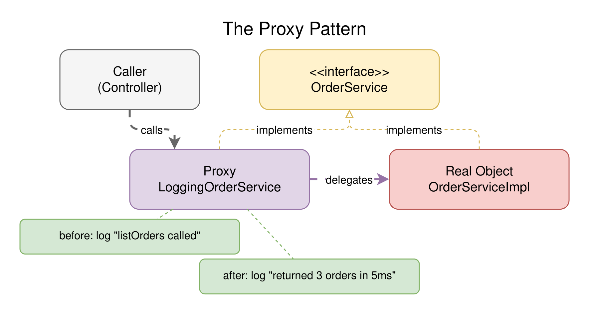
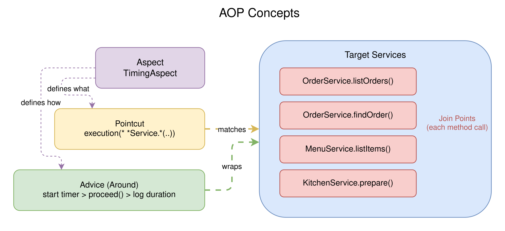
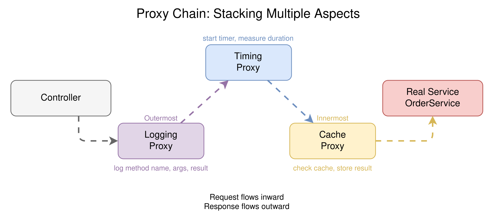

# Session 4: Proxy Pattern and AOP

> **How Framework "Magic" Actually Works: Proxies, Decorators, and Invisible Wrappers**

`#proxy` `#aop` `#decorators` `#middleware` `#spring` `#fastapi` `#nestjs` `#go`

## The Problem

You've seen this before:

```java

@Transactional
public void placeOrder(Order order) {
    orderRepository.save(order);
    notificationService.notify(order);
}
```

One annotation. No transaction management code. No `begin()`, no `commit()`, no `rollback()`. You just write `@Transactional` and Spring handles the rest. How?

Or this:

```python
@app.get("/orders")
@cache(expire=60)
async def list_orders():
    return await repository.find_all()
```

One decorator. No cache lookup code. No cache write code. No TTL management. You just write `@cache` and the framework handles the rest. How?

The answer is the same in every case: **proxies**. The framework replaces your object with a wrapper that adds behavior before and after your code runs. Your code doesn't change.
The framework intercepts the call, does its thing, and then calls your original method.

This is the Proxy pattern. And when you apply it systematically across many methods based on rules (rather than wrapping one method at a time), it becomes Aspect-Oriented
Programming (AOP).

## The Proxy Pattern: Wrapping Without Modifying

A proxy is an object that stands in for another object. It has the same interface, so the caller can't tell the difference. But the proxy adds behavior before, after, or around the
real method call.

```
Caller  ──▶  Proxy  ──▶  Real Object
              │
              ├── before: start timer
              ├── delegate to real object
              └── after: log duration
```

The key insight: the caller never knows it's talking to a proxy. It calls the same method with the same signature. The proxy is invisible.

<picture>
  <source media="(prefers-color-scheme: dark)" srcset="diagrams/dark/proxy-pattern.svg">
  <source media="(prefers-color-scheme: light)" srcset="diagrams/light/proxy-pattern.svg">
  
</picture>

### Why Not Just Modify the Code?

You could add logging to every method by hand:

```java
public List<Order> listOrders() {
    long start = System.currentTimeMillis();
    log.info("listOrders called");
    try {
        List<Order> result = repository.findAll();
        log.info("listOrders returned {} orders in {}ms",
            result.size(), System.currentTimeMillis() - start);
        return result;
    } catch (Exception e) {
        log.error("listOrders failed", e);
        throw e;
    }
}
```

Now do that for 50 methods. Then add caching. Then add metrics. Then add transaction management. Your business logic drowns in cross-cutting concerns.

The Proxy pattern solves this: write the cross-cutting logic once, apply it to many methods without touching them.

## From Proxy to AOP: Systematic Wrapping

AOP (Aspect-Oriented Programming) is just the Proxy pattern applied systematically. Instead of wrapping one method, you define:

- **Aspect** - the cross-cutting behavior (logging, timing, caching)
- **Pointcut** - which methods to wrap (all methods in `*Service`, methods annotated with `@Timed`)
- **Advice** - when to run (before, after, around the method call)

| AOP Term   | Plain English                                 | Example                                |
|------------|-----------------------------------------------|----------------------------------------|
| Aspect     | The behavior you want to add                  | "Log every method call with timing"    |
| Pointcut   | Which methods to target                       | "All public methods in `*Service`"     |
| Advice     | When to run relative to the method            | "Around: before and after"             |
| Join point | A specific method execution being intercepted | `OrderService.listOrders()` call       |
| Weaving    | The act of applying the aspect to the code    | At compile time, load time, or runtime |

<picture>
  <source media="(prefers-color-scheme: dark)" srcset="diagrams/dark/aop-concepts.svg">
  <source media="(prefers-color-scheme: light)" srcset="diagrams/light/aop-concepts.svg">
  
</picture>

## How Each Framework Implements Proxies

Every framework does the same thing: wraps your objects so it can run code before/after your methods. The mechanism differs, but the result is identical.

### Java (Spring Boot): Dynamic Proxies and CGLIB

Spring creates proxies at runtime. Two mechanisms:

- **JDK Dynamic Proxy** - if your class implements an interface, Spring creates a proxy that implements the same interface and delegates to your object. Uses
  `java.lang.reflect.Proxy`.
- **CGLIB Proxy** - if your class has no interface, Spring generates a subclass at runtime using bytecode generation. The subclass overrides your methods and adds behavior.

You never see this. When you inject `OrderService`, Spring actually injects a proxy that looks like `OrderService` but intercepts method calls.

```java

@Aspect
@Component
public class TimingAspect {

    @Around("execution(* coffeeshop.order.OrderService.*(..))")
    public Object timeMethod(ProceedingJoinPoint joinPoint) throws Throwable {
        long start = System.currentTimeMillis();
        Object result = joinPoint.proceed(); // call the real method
        long duration = System.currentTimeMillis() - start;
        System.out.println(joinPoint.getSignature().getName() + " took " + duration + "ms");
        return result;
    }
}
```

`joinPoint.proceed()` is the "call the real method" step. Everything before it is "before advice", everything after is "after advice".

### Python (FastAPI): Decorators

Python decorators ARE proxies. A decorator takes a function, returns a new function that wraps it:

```python
def timed(func):
    @wraps(func)
    def wrapper(*args, **kwargs):
        start = time.time()
        result = func(*args, **kwargs)  # call the real function
        duration = (time.time() - start) * 1000
        print(f"{func.__name__} took {duration:.0f}ms")
        return result

    return wrapper


@timed
def list_orders():
    return repository.find_all()
```

When you call `list_orders()`, you're actually calling `wrapper()`, which calls the real `list_orders()` inside. The caller doesn't know the difference.

FastAPI's `Depends()` is also a proxy mechanism: it wraps your handler and resolves dependencies before calling it.

### TypeScript (NestJS): Decorators and Interceptors

NestJS uses two proxy mechanisms:

- **Interceptors** (from Session 3) wrap the handler execution via RxJS. They're AOP at the request level.
- **Custom decorators** with `reflect-metadata` store metadata that NestJS reads at runtime to apply behavior.

```typescript

@Injectable()
export class TimingInterceptor implements NestInterceptor {
    intercept(context: ExecutionContext, next: CallHandler): Observable<any> {
        const start = Date.now();
        return next.handle().pipe(
            tap(() => console.log(`${context.getHandler().name} took ${Date.now() - start}ms`)),
        );
    }
}
```

NestJS also supports method-level decorators that work like Spring's `@Transactional`:

```typescript
@UseInterceptors(TimingInterceptor)
@Get("/orders")
listOrders() { ...}
```

### Go: Wrapper Functions and Middleware

Go doesn't have annotations, decorators, or runtime proxies. Instead, Go uses the same pattern explicitly through **wrapper functions** and **interfaces**:

```go
type TimedOrderService struct {
    inner OrderService  // the real service
}

func (t *TimedOrderService) ListOrders() []Order {
    start := time.Now()
    result := t.inner.ListOrders()  // call the real method
    fmt.Printf("ListOrders took %s\n", time.Since(start))
    return result
}
```

This is the Proxy pattern in its purest form: same interface, wraps the real object, adds behavior. No magic, no reflection, no bytecode generation. Just Go interfaces and
composition.

For functions (not methods), Go uses higher-order functions:

```go
func timed(name string, fn func()) func() {
    return func() {
        start := time.Now()
        fn()
        fmt.Printf("%s took %s\n", name, time.Since(start))
    }
}
```

## The Proxy Chain: Stacking Multiple Aspects

In real applications, you don't have just one proxy. You have many: logging, timing, caching, transactions, auth. They stack:

```
Caller  ──▶  [Logging Proxy]  ──▶  [Timing Proxy]  ──▶  [Cache Proxy]  ──▶  Real Object
```

Each proxy wraps the next. The call goes through all of them. This is the same onion model from Session 3's middleware, but at the method level instead of the request level.

<picture>
  <source media="(prefers-color-scheme: dark)" srcset="diagrams/dark/proxy-chain.svg">
  <source media="(prefers-color-scheme: light)" srcset="diagrams/light/proxy-chain.svg">
  
</picture>

| Framework   | How proxies stack                                             |
|-------------|---------------------------------------------------------------|
| Spring Boot | `@Order` on aspects controls execution order                  |
| FastAPI     | Decorator stacking: `@timed @cached @logged` (bottom-up)      |
| NestJS      | Multiple interceptors: `@UseInterceptors(A, B, C)` (in order) |
| Go          | Wrapper composition: `NewLogged(NewTimed(NewCached(real)))`   |

## How This Connects to Previous Sessions

- **Session 1 (IoC)**: The framework calls your code. Now you see how it can call *extra* code around yours without you knowing.
- **Session 2 (DI)**: The framework wires your dependencies. Now you see it can wire a *proxy* instead of the real object, and you never notice.
- **Session 3 (Middleware)**: Middleware wraps the request pipeline. Proxies wrap individual method calls. Same pattern, different granularity.

The progression: Session 3 showed the onion at the HTTP level. Session 4 shows the onion at the method level.

## Try It Yourself

Each language subfolder has a Coffee Shop project where all four services are wrapped with proxies that add logging, timing, and audit behavior, all without modifying the service
code.

1. **Run the project** and hit `GET /orders`. Look at the console: you'll see proxy logs showing method calls, arguments, return values, and timing, even though the service code
   has no logging.
2. **Add a caching proxy** for `MenuService.listItems()`. The first call hits the repository, subsequent calls return the cached result. The service code doesn't change.
3. **Add a validation proxy** for `OrderService`. Before `findOrder(id)`, check that `id > 0`. Throw an error if not. The service code doesn't change.
4. **Stack three proxies**: logging + timing + validation on `OrderService`. Verify they all run in order.
5. **Write a proxy/decorator that counts method calls.** After 10 calls to any method, log a warning. No changes to service code.

> **Want to check your work?** Each language README links to a solution branch where all exercises are already implemented.

## Key Takeaways

- **Proxies wrap objects with the same interface.** The caller can't tell it's talking to a proxy. This is how `@Transactional`, `@Cacheable`, and `@Timed` work.
- **AOP is the Proxy pattern applied systematically.** Define what to add (aspect), where to add it (pointcut), and when to run (advice).
- **Every framework does the same thing differently.** Spring uses CGLIB/JDK proxies. Python uses decorators. NestJS uses interceptors. Go uses wrapper structs. Same pattern,
  different syntax.
- **Proxies stack like middleware.** Multiple proxies chain together, each wrapping the next. Order matters.
- **The power is in not modifying code.** You add observability, caching, validation, and transactions without touching the business logic. That's the whole point.

## Language Examples

Each language folder includes the Coffee Shop project with proxy-wrapped services, demonstrating logging, timing, and audit aspects applied without modifying service code.

| Language   | Framework    | Folder                     |
|------------|--------------|----------------------------|
| Java       | Spring Boot  | [java/](java/)             |
| Python     | FastAPI      | [python/](python/)         |
| TypeScript | NestJS       | [typescript/](typescript/) |
| Go         | Gin / stdlib | [go/](go/)                 |

---

*Previous: [Session 3: Who Owns the Main Loop?](../session-03-who-owns-the-main-loop/) - Request lifecycle, middleware pipelines, and lifecycle hooks.*

*Next up: [Session 5: Chaos Engineering](../session-05-chaos-engineering/) - Breaking things so your users don't have to.*
