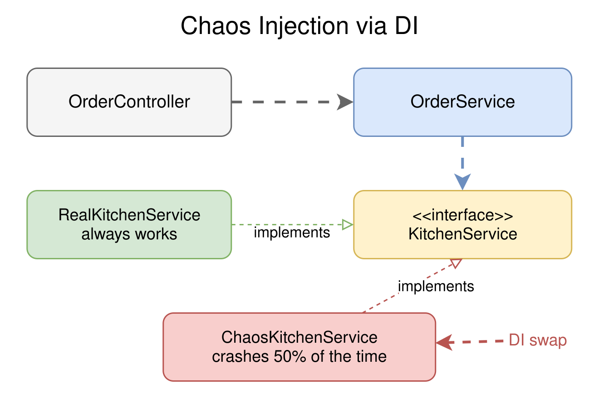
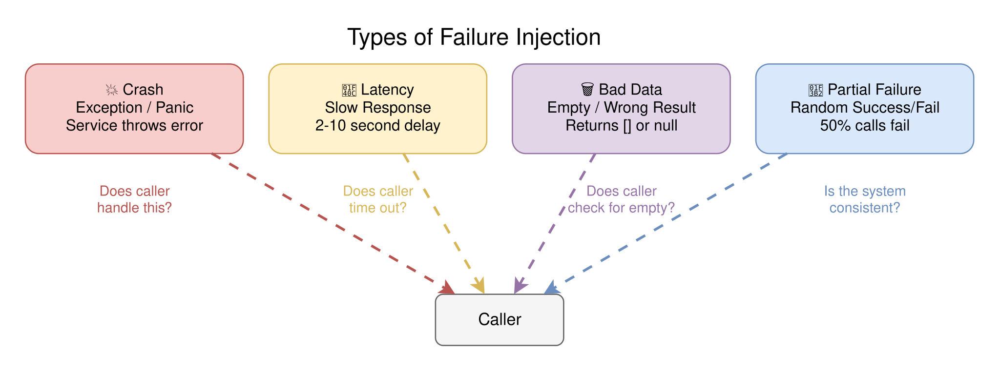
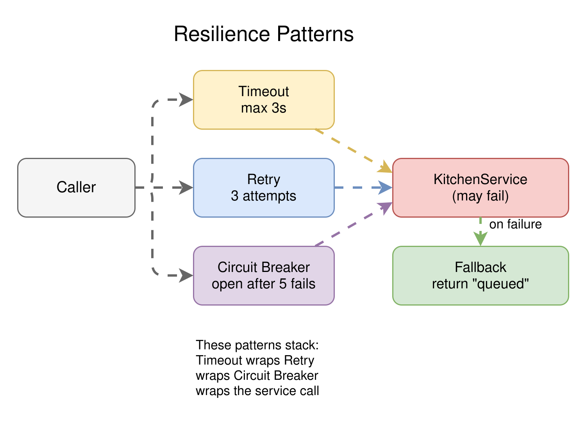

# Session 5: Chaos Engineering

> **Breaking Things So Your Users Don't Have To: Failure Injection, Resilience, and What Happens When Services Misbehave**

`#chaos` `#testing` `#failure-injection` `#resilience` `#spring` `#fastapi` `#nestjs` `#go`

## Why Break Things on Purpose?

Your Coffee Shop has four services: Orders, Menu, Kitchen, Notifications. In production, any of them can:

- **Crash** - throw an exception, panic, return null
- **Stall** - take 30 seconds instead of 30 milliseconds
- **Return garbage** - empty list, wrong data, malformed response
- **Disappear** - network timeout, connection refused

Happy-path tests won't catch these. Your integration tests pass, your demo works, then production disagrees because the Kitchen service is slow on Tuesdays and the Notification
service drops messages under load.

Chaos Engineering is the discipline of experimenting on a system to build confidence in its ability to withstand turbulent conditions. Netflix coined it. We're going to do it with
our Coffee Shop.

## The Core Idea: Swap, Break, Observe

The patterns from previous sessions make chaos engineering possible:

1. **DI (Session 2)** lets you swap a real dependency for a failable one. Instead of `InMemoryKitchenService`, inject `ChaosKitchenService` that crashes 50% of the time.
2. **Proxies (Session 4)** let you observe every failure. Your logging/timing aspects capture exactly what went wrong, when, and how long it took.
3. **Middleware (Session 3)** lets you add resilience layers (timeouts, retries, circuit breakers) without modifying business logic.

```
Normal:    Controller ──▶ OrderService ──▶ KitchenService ──▶ ✅ preparing
Chaos:     Controller ──▶ OrderService ──▶ ChaosKitchenService ──▶ 💥 random failure
```

<picture>
  <source media="(prefers-color-scheme: dark)" srcset="diagrams/dark/chaos-injection.svg">
  <source media="(prefers-color-scheme: light)" srcset="diagrams/light/chaos-injection.svg">
  
</picture>

## Types of Failure Injection

### 1. Exceptions / Panics

The service throws an error randomly or on specific conditions:

```java
public Preparation prepare(int orderId, String drink) {
    if (Math.random() < 0.5) {
        throw new RuntimeException("Kitchen equipment malfunction!");
    }
    return new Preparation(orderId, drink, "preparing");
}
```

**What to watch:** Does the caller handle the exception? Does it propagate all the way to the HTTP response? What status code does the user see?

### 2. Latency Injection

The service works correctly but takes much longer than expected:

```python
def prepare(self, order_id: int, drink: str) -> Preparation:
    time.sleep(random.uniform(2.0, 10.0))  # 2-10 second delay
    return Preparation(order_id=order_id, drink=drink, status="preparing")
```

**What to watch:** Does the caller time out? Does the whole request stall? Are there cascading delays (one slow service makes everything slow)?

### 3. Empty / Wrong Data

The service returns valid but unexpected data:

```go
func (s *ChaosMenuService) ListItems() []MenuItem {
    return []MenuItem{} // empty menu
}
```

**What to watch:** Does the UI handle an empty list? Does downstream code crash on nil/empty? Are error messages helpful?

### 4. Partial Failure

Some calls succeed, some fail. This is the hardest to handle because the system is in an inconsistent state:

```typescript
function findOrder(id: number): Order | undefined {
    if (id % 2 === 0) return undefined; // even IDs "don't exist"
    return this.repository.findById(id);
}
```

<picture>
  <source media="(prefers-color-scheme: dark)" srcset="diagrams/dark/failure-types.svg">
  <source media="(prefers-color-scheme: light)" srcset="diagrams/light/failure-types.svg">
  
</picture>

## Resilience Patterns

Once you can inject failures, you can build defenses:

### Timeout

Don't wait forever. Set a maximum time for each operation:

```
If KitchenService doesn't respond in 3 seconds, give up and return an error.
```

Without timeouts, one slow service can stall your entire application. Users see a spinning loader, your thread pool fills up, and eventually everything crashes.

### Retry

If something fails, try again. But be smart about it:

- **Fixed retry**: wait 1s, try again (simple but can overwhelm a struggling service)
- **Exponential backoff**: wait 1s, 2s, 4s, 8s (gives the service time to recover)
- **Retry with jitter**: add randomness to avoid thundering herd (all retries hitting at the same time)

### Circuit Breaker

If a service keeps failing, stop calling it for a while:

```
CLOSED (normal) ──▶ too many failures ──▶ OPEN (reject all calls)
                                              │
                                         wait timeout
                                              │
                                         HALF-OPEN (try one call)
                                              │
                                    success ──▶ CLOSED
                                    failure ──▶ OPEN
```

This prevents cascading failures. If KitchenService is down, the circuit breaker stops sending requests to it, letting it recover instead of piling on more load.

### Fallback

If the primary path fails, use a backup:

```
try: KitchenService.prepare(order)
catch: return Preparation(status="queued")  // degrade gracefully
```

The user gets a "your order is queued" message instead of a 500 error.

<picture>
  <source media="(prefers-color-scheme: dark)" srcset="diagrams/dark/resilience-patterns.svg">
  <source media="(prefers-color-scheme: light)" srcset="diagrams/light/resilience-patterns.svg">
  
</picture>

## How Each Framework Handles Chaos

| Pattern           | Spring Boot                              | FastAPI              | NestJS                    | Go                               |
|-------------------|------------------------------------------|----------------------|---------------------------|----------------------------------|
| Failure injection | Swap beans via `@Profile` / `@Qualifier` | Swap via `Depends()` | Swap via module providers | Swap via interface + constructor |
| Timeout           | `@Transactional(timeout=)`, Resilience4j | `asyncio.wait_for()` | RxJS `timeout()`          | `context.WithTimeout()`          |
| Retry             | Resilience4j `@Retry`                    | `tenacity` library   | Custom interceptor        | `for` loop with backoff          |
| Circuit breaker   | Resilience4j `@CircuitBreaker`           | `pybreaker` library  | Custom interceptor        | Manual state machine             |
| Fallback          | `@CircuitBreaker(fallbackMethod=)`       | `try/except`         | `catchError()` in RxJS    | `if err != nil`                  |

## How This Connects to Previous Sessions

- **Session 2 (DI)**: You can swap `KitchenService` for `ChaosKitchenService` because DI wires dependencies through interfaces. The controller doesn't know or care which
  implementation it gets.
- **Session 4 (Proxy)**: Your logging/timing aspects (from Session 4) automatically capture every failure. You don't need to add error logging to the chaos services; the proxy
  chain already observes everything.
- **Session 3 (Middleware)**: Resilience layers (timeouts, retries) are middleware at the service level. They wrap the call, add behavior, and delegate. Same onion model.

## Try It Yourself

Each language subfolder has a Coffee Shop project with chaos-injectable services. The normal services work perfectly. The chaos versions randomly fail.

1. **Run the project** with normal services. Hit all endpoints. Everything works.
2. **Switch to chaos mode**: swap the normal `KitchenService` for `ChaosKitchenService`. Hit `GET /orders/1` repeatedly. Watch some calls succeed and some fail.
3. **Add a timeout**: wrap `KitchenService` calls with a 3-second timeout. Inject latency chaos (5-second delay). See the timeout kick in.
4. **Add a fallback**: when `KitchenService` fails, return a "queued" status instead of crashing.
5. **Add a retry**: retry failed `KitchenService` calls up to 3 times with 1-second intervals.
6. **Combine them**: timeout + retry + fallback. Hit the endpoint 20 times. Count successes vs failures.

> **Want to check your work?** Each language README links to a solution branch.

## Key Takeaways

- **Break things on purpose before they break in production.** Chaos engineering is about building confidence, not causing damage.
- **DI makes chaos possible.** Without interface-based injection, you can't swap a real service for a failable one.
- **Proxies make chaos observable.** Your existing aspects capture every failure without extra code.
- **Resilience is not optional.** Timeouts, retries, circuit breakers, and fallbacks are not "nice to have". They're how production systems survive.
- **Every framework handles resilience differently**, but the patterns are the same: timeout, retry, circuit breaker, fallback.

## Language Examples

| Language   | Framework    | Folder                     |
|------------|--------------|----------------------------|
| Java       | Spring Boot  | [java/](java/)             |
| Python     | FastAPI      | [python/](python/)         |
| TypeScript | NestJS       | [typescript/](typescript/) |
| Go         | Gin / stdlib | [go/](go/)                 |

---

*Previous: [Session 4: Proxy Pattern and AOP](../session-04-proxy-and-aop/) - Wrapping objects with invisible behavior.*

*Next up: [Session 6: Putting It All Together](../session-06-capstone/) - DI, proxies, and chaos in one project.*
