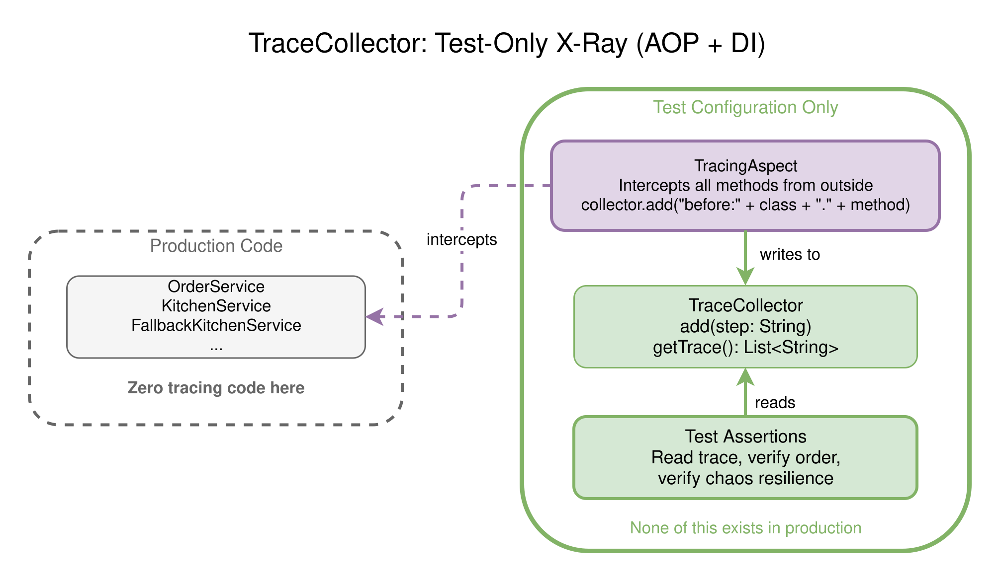
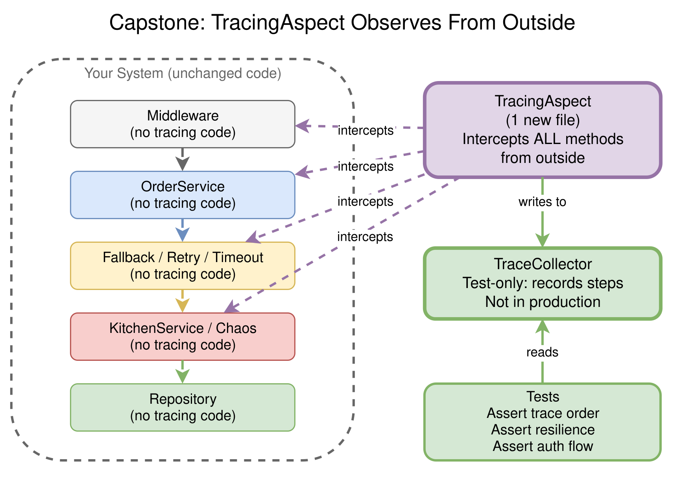
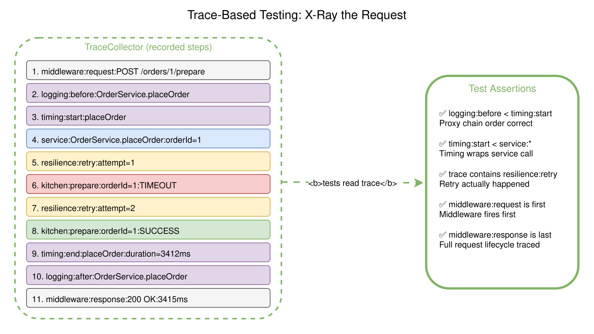

# Session 6: Putting It All Together

> **Testing the Invisible: X-Raying Your System's Belly with AOP, DI, and Automated Verification**

`#capstone` `#e2e` `#observability` `#all-patterns` `#spring` `#fastapi` `#nestjs` `#go`

## The Problem: You Built It, But Does It Actually Work Under Pressure?

Sessions 1 through 5 each taught one pattern in isolation. You built logging aspects, timing proxies, circuit breakers, fallback wrappers. But here's what you never did:

- **Session 4** added proxies and aspects, but you never proved they fire in the right order.
- **Session 5** injected chaos, but you watched the console and hoped for the best. You never *verified* that the fallback caught the timeout, or that the retry actually retried.

In production, "I think it works" isn't enough. You need to **see inside the system while it's under pressure** and **prove** everything behaved correctly.

This session combines all five previous patterns into one project and adds the missing piece: a **TracingAspect** that X-rays the system's belly while chaos is breaking things. AOP
records what happened. DI wires the X-ray machine in. Chaos applies the stress. Tests read the results and assert the system held up.

This is where all five sessions stop being theory and start working together for real.

## The Big Idea: Trace Collector

The core concept is a **TraceCollector**: a thread-safe list that records every step a request takes through the system.

The critical rule: **no existing class is modified**. Not a single line added to `OrderService`, `KitchenService`, `FallbackKitchenService`, or any middleware. A single
**TracingAspect** sits **outside** the system and intercepts method calls via AOP. It's the X-ray machine strapped to the patient, not surgery on the patient's organs.

```java
// This is a SINGLE aspect class. It intercepts all service calls.
// OrderService, KitchenService, etc. have ZERO knowledge of tracing.
@Aspect
public class TracingAspect {

  private final TraceCollector collector;

  @Around("execution(* coffeeshop..*.*(..))")
  public Object trace(ProceedingJoinPoint jp) throws Throwable {
    String step = jp.getSignature().getDeclaringType().getSimpleName()
            + "." + jp.getSignature().getName();
    collector.add("before:" + step);
    try {
      Object result = jp.proceed();
      collector.add("after:" + step);
      return result;
    } catch (Throwable t) {
      collector.add("error:" + step + ":" + t.getMessage());
      throw t;
    }
  }
}
```

The aspect intercepts every method in the `coffeeshop` package. When `OrderService.placeOrder()` calls `KitchenService.prepare()`, which hits `FallbackKitchenService`, which hits
`RetryKitchenService`, the trace captures all of it automatically. None of those classes know they're being traced.

After the request, tests read the trace and **assert the entire internal journey**:

```java
List<String> trace = traceCollector.getTrace();

// Verify logging wrapped timing (outermost runs first)
assertThat(indexOf(trace, "before:LoggingAspect")).isLessThan(indexOf(trace, "before:TimingAspect"));

// Verify retry happened (chaos injected a failure)
assertThat(trace).anyMatch(e -> e.startsWith("before:RetryKitchenService"));

// Verify kitchen was actually called
assertThat(trace).anyMatch(e -> e.contains("KitchenService.prepare"));
```

This is the X-ray. You're not testing what the system returns. You're testing what the system **did internally** to produce that result. And you did it without touching a single
line of business code.

<picture>
  <source media="(prefers-color-scheme: dark)" srcset="diagrams/dark/trace-collector.svg">
  <source media="(prefers-color-scheme: light)" srcset="diagrams/light/trace-collector.svg">
  
</picture>

## What Makes This Different From Sessions 4 and 5

|                 | Session 4 (Proxy/AOP) | Session 5 (Chaos)           | Session 6 (Capstone)                           |
|-----------------|-----------------------|-----------------------------|------------------------------------------------|
| Proxies/aspects | Built them            | -                           | Uses them + traces them                        |
| Chaos injection | -                     | Built it                    | Runs it under observation                      |
| Resilience      | -                     | Built it                    | Proves it works via trace                      |
| Verification    | Manual (read console) | Manual (hit endpoint, hope) | **Automated tests with trace assertions**      |
| The question    | "Can I add behavior?" | "Can I break things?"       | "Can I prove the system works under pressure?" |

Session 5 told you "the fallback caught the error." Session 6 shows you the **exact trace**: chaos threw at attempt 1, retry caught it, attempt 2 timed out, attempt 3 succeeded,
fallback never needed. Or: chaos threw 5 times in a row, circuit breaker opened, all subsequent requests got fast-rejected, fallback returned "queued". You **see** it and you
**assert** it.

## Why This Matters: A Real-World Example

Imagine an auth system that issues JWTs. From the outside, the endpoint returns a token. But **inside**, the system should:

1. Validate the credentials against the identity store
2. Verify the user has access to the requested resource
3. Check rate limits
4. **Then** generate the JWT

Without tracing, you can only test "did I get a token?" With tracing, you can verify the **order of operations**: "did the system actually verify identity and check access BEFORE
generating the token?"

Now add chaos: what if the identity store is slow? Does the system still check access before generating the token, or does it skip the check and issue a token anyway? The trace
tells you.

In our Coffee Shop, the same idea applies:

- Did the logging aspect fire BEFORE the timing aspect? (proxy chain order)
- Under chaos: did the retry actually retry, or did the fallback swallow the error silently? (resilience correctness)
- After 5 consecutive kitchen crashes, did the circuit breaker open? (circuit breaker behavior)
- When the circuit breaker is open, do requests get fast-rejected or do they hang? (timeout behavior)

## The Architecture

```
                                                        ┌──────────────────────┐
HTTP Request                                            │  TracingAspect       │
    │                                                   │  (sits OUTSIDE the   │
    ▼                                                   │   system, intercepts │
┌───────────────────────────────────┐                   │   all method calls   │
│  Middleware                       │ ◄── intercepted ──│   automatically)     │
│  (unchanged code)                 │                   │                      │
└───────────────┬───────────────────┘                   │  Zero lines added    │
                │                                       │  to any existing     │
                ▼                                       │  class               │
┌───────────────────────────────────┐                   │                      │
│  Service Layer                    │ ◄── intercepted ──│                      │
│  (unchanged code)                 │                   │                      │
└───────────────┬───────────────────┘                   └──────────┬───────────┘
                │                                                  │
                ▼                                                  ▼
┌───────────────────────────────────┐                   ┌──────────────────────┐
│  Resilience / Kitchen             │ ◄── intercepted ──│  TraceCollector      │
│  (unchanged code)                 │                   │  (records steps)     │
└───────────────────────────────────┘                   └──────────────────────┘
```

The TracingAspect sits **outside** every layer and intercepts method calls automatically. No existing class is modified.

The TracingAspect and TraceCollector **only exist in tests**. Production code has zero tracing: no aspect registered, no collector bean, nothing added. DI makes this possible: the
test configuration registers the aspect and collector; the production configuration doesn't.

<picture>
  <source media="(prefers-color-scheme: dark)" srcset="diagrams/dark/full-architecture.svg">
  <source media="(prefers-color-scheme: light)" srcset="diagrams/light/full-architecture.svg">
  
</picture>

## Four Types of Tests: From Structure to Stress

### 1. Proxy Chain Order Tests (Session 4 verified)

Verify that aspects fire in the correct order. If logging wraps timing wraps audit, the trace should reflect that:

```
before:LoggingProxy → before:TimingProxy → before:OrderService → after:OrderService → after:TimingProxy → after:LoggingProxy
```

A test asserts: "LoggingProxy appears before TimingProxy in the trace." If someone reorders the proxy chain, the test catches it. This is something Session 4 never verified.

### 2. Chaos Stress Tests (Session 5 verified)

This is where it gets interesting. Run the app in **chaos mode**, hit the endpoint under load, and use the trace to verify the resilience stack actually did its job:

```python
# Stress test: hit endpoint 50 times with chaos active
results = [client.post("/orders/1/prepare") for _ in range(50)]

# All should return 200 (fallback catches everything)
assert all(r.status_code == 200 for r in results)

# The trace proves HOW they returned 200:
traces_with_retry = [t for t in all_traces if "RetryKitchenService" in t]
assert len(traces_with_retry) > 0  # retry actually kicked in

traces_with_fallback = [t for t in all_traces if "FallbackKitchenService" in t]
assert len(traces_with_fallback) > 0  # fallback caught failures

# In session 5, you watched the console and counted manually.
# Now it's an automated test that runs in CI.
```

### 3. Resilience Correctness Tests (the new thing)

Not just "did resilience work" but "did it work in the right order?" The trace lets you verify:

```java
// Trace from a single chaos request:
// before:FallbackKitchenService.prepare
//   before:RetryKitchenService.prepare
//     before:TimeoutKitchenService.prepare
//       before:ChaosKitchenService.prepare
//       error:ChaosKitchenService.prepare:equipment malfunction
//     after:TimeoutKitchenService.prepare  (propagated error)
//   before:TimeoutKitchenService.prepare  (retry attempt 2)
//     before:ChaosKitchenService.prepare
//     after:ChaosKitchenService.prepare   (success on attempt 2)
//   after:RetryKitchenService.prepare
// after:FallbackKitchenService.prepare

// Assert: Fallback wraps Retry wraps Timeout wraps Chaos
assertThat(indexOf(trace, "FallbackKitchenService"))
    .isLessThan(indexOf(trace, "RetryKitchenService"));
assertThat(indexOf(trace, "RetryKitchenService"))
    .isLessThan(indexOf(trace, "TimeoutKitchenService"));
assertThat(indexOf(trace, "TimeoutKitchenService"))
    .isLessThan(indexOf(trace, "ChaosKitchenService"));
```

This is something neither Session 4 nor Session 5 could do alone. You need the proxy chain (Session 4), the chaos injection (Session 5), AND the tracing aspect (Session 6) working
together.

### 4. End-to-End Trace Tests (all sessions together)

Start the server in chaos mode, make a request, collect the trace, and verify the complete journey from HTTP to kitchen and back:

```go
trace := traceCollector.GetTrace()

// The full path is visible: every layer, every retry, every fallback
assertStartsWith(trace[0], "before:RequestLoggingMiddleware")   // Session 3
assertContains(trace, "before:LoggingProxy")                    // Session 4
assertContains(trace, "before:FallbackKitchenService")          // Session 5
assertContains(trace, "before:ChaosKitchenService")             // Session 5
assertStartsWith(trace[len(trace)-1], "after:RequestLoggingMiddleware")
```

<picture>
  <source media="(prefers-color-scheme: dark)" srcset="diagrams/dark/request-trace.svg">
  <source media="(prefers-color-scheme: light)" srcset="diagrams/light/request-trace.svg">
  
</picture>

## How Each Framework Implements Tracing

| Concern            | Spring Boot                       | FastAPI                            | NestJS                           | Go                               |
|--------------------|-----------------------------------|------------------------------------|----------------------------------|----------------------------------|
| TracingAspect      | `@Aspect` + `@Around`             | Decorator wrapping services        | `@UseInterceptors` on module     | Wrapper struct around interfaces |
| TraceCollector     | `@RequestScope` bean              | Context var per request            | Request-scoped provider          | Context value on `*gin.Context`  |
| What gets modified | **Only test config (new files)**  | **Only test config (new files)**   | **Only test config (new files)** | **Only test config (new files)** |
| Production code    | **Untouched, zero tracing**       | **Untouched, zero tracing**        | **Untouched, zero tracing**      | **Untouched, zero tracing**      |
| Tests read trace   | `@Autowired` in `@SpringBootTest` | `TestClient` + dependency override | `moduleRef.get()` in test module | Pass collector in test setup     |

## Try It Yourself

Each language subfolder has the complete Coffee Shop with all patterns wired together: DI, proxies, chaos, resilience, middleware, TracingAspect, and tests.

1. **Run the tests.** See the proxy chain order test, chaos stress test, and e2e trace test pass.
2. **Read a trace.** Look at the test output. Each test prints the full trace it captured. Match the steps to the architecture diagram.
3. **Break the proxy order.** Swap Logging and Timing in the proxy chain. Watch the proxy chain order test fail.
4. **Stress test.** Hit `POST /orders/1/prepare` 50 times in chaos mode. Read the traces. How many retries? How many fallbacks? Did the circuit breaker open?
5. **Add an auth layer.** Create a simple `AuthMiddleware`. The TracingAspect will pick it up automatically (no code changes to the aspect). Write a test that verifies auth runs before the service call.
6. **Write a chaos resilience test.** 50 requests in chaos mode: assert success rate > 70%, at least one retry in the traces, at least one fallback activation.

> **Want to check your work?** Each language README links to a solution branch.

## Key Takeaways

- **The X-ray only works under stress.** Tracing a normal request is boring: everything succeeds. Tracing a request during chaos is where you learn: retries fire, circuit breakers open, fallbacks activate. That's when the invisible parts become visible.
- **AOP is an X-ray machine, not a feature.** The TracingAspect adds zero lines to any existing class. It observes from outside. That's the power of AOP: the system doesn't know it's being watched.
- **DI makes the whole thing possible.** Swap `NoOpTraceCollector` for `InMemoryTraceCollector`. Swap `RealKitchenService` for `ChaosKitchenService`. Same interfaces, different implementations. Without DI (Session 2), none of this works.
- **Order matters, and now you can prove it.** Auth before access. Logging outside timing. Fallback outside retry. The trace proves the order. Without it, you're guessing.
- **These patterns are a system, not separate topics.** IoC gives the framework control (Session 1). DI wires the services (Session 2). The main loop processes requests (Session 3). Proxies add behavior (Session 4). Chaos tests resilience (Session 5). Tracing proves it all works (Session 6). Remove any one piece and the others lose their power.

## Language Examples

| Language   | Framework    | Folder                     |
|------------|--------------|----------------------------|
| Java       | Spring Boot  | [java/](java/)             |
| Python     | FastAPI      | [python/](python/)         |
| TypeScript | NestJS       | [typescript/](typescript/) |
| Go         | Gin / stdlib | [go/](go/)                 |

---

*Previous: [Session 5: Chaos Engineering](../session-05-chaos-engineering/) - Breaking things on purpose.*

*This is the final session of the Under the Hood Workshop series.*
